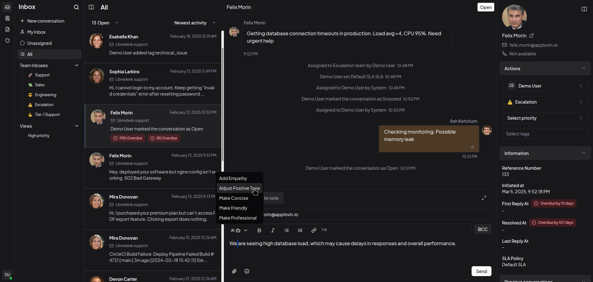

# Introduction

Libredesk is an open-source, self-hosted customer support desk — single binary app.

  

## Developers

Libredesk is licensed under AGPLv3. Contributions are welcome.

- Source code: [GitHub](https://github.com/abhinavxd/libredesk)
- Setup guide: [Developer setup](developer-setup.md)
- Stack: Go backend, Vue 3 frontend (Shadcn UI)
